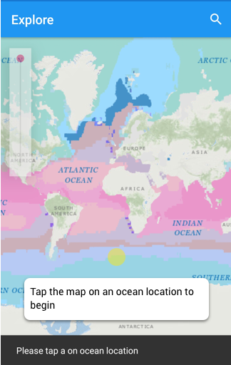
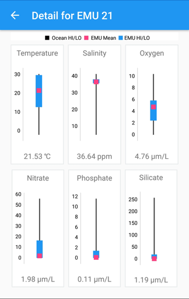
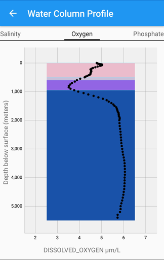
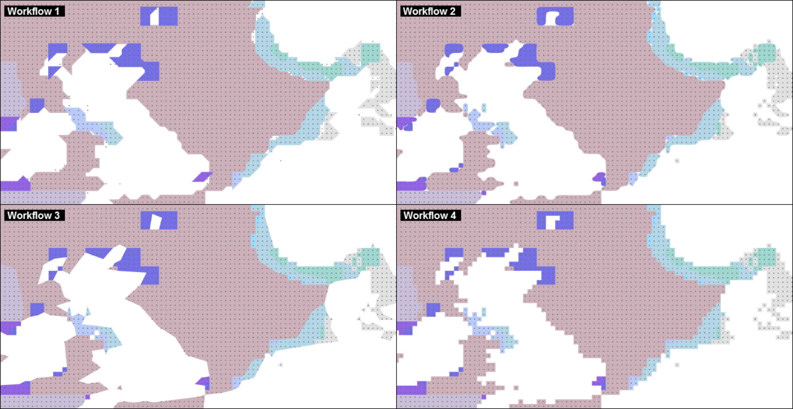
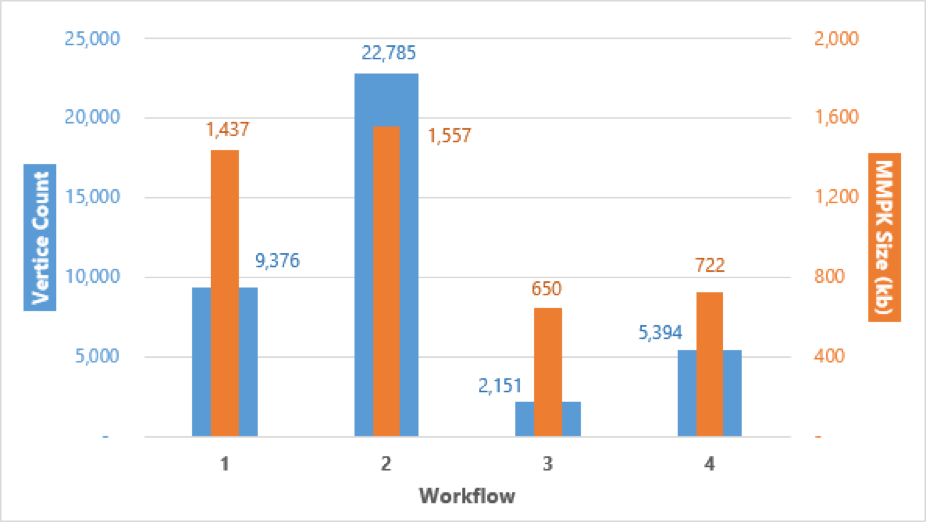
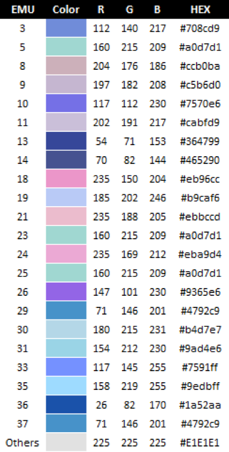

# Ecological Marine Unit Explorer
Explore our ocean ecosystems with EMUs!

## Description
Using 50 year's worth of aggregated nutrient and physical ocean data from [NOAA](https://www.nodc.noaa.gov/OC5/woa13/), Esri has collaborated with the USGS, the Marine Conservation Institute, NatureServe, the University of Auckland, GRID-Arendal, NOAA, Duke University, the Woods Hole Oceanographic Institution, and many other partners to classify our oceans into 37 statistically distinct [ecological marine units](http://www.esri.com/ecological-marine-units) (EMUs).  Leveraging the [Runtime SDK](https://developers.arcgis.com/) and [ArcGIS](http://www.arcgis.com/home/index.html), we'll show you how this Android mobile app can be used to explore ocean conditions locally and globally. There are a number of ocean data resources you can use to supplement the EMU story.  For example, the [Ocean Biogeographic Information System](http://www.iobis.org/) hosts free and open access to ocean  biogeographic datasets.

## Feature Services
The heart of this application lies in the rich data stores collected by NOAA and analyzed by the scientific collaboration mentioned above.  Over 50 million spatial and non-spatial datapoints are hosted through AGOL [feature services](http://server.arcgis.com/en/server/10.5/publish-services/windows/what-is-a-feature-service-.htm).  Most of the read-only feature services in this application were constructed by the [Esri Oceans group](https://esri.maps.arcgis.com/home/user.html?user=esri_oceans), published using [ArcGISPro](https://pro.arcgis.com/en/pro-app/help/sharing/overview/share-with-arcgis-pro.htm) or ArcMap, and made publicly available. The EMU feature services are also used by the [Ecological Marine Unit Explorer](http://livingatlas.arcgis.com/emu/), a web version of this application. Learn more about how this data set was assembled in this [Story Map](http://esrioceans.maps.arcgis.com/apps/MapJournal/index.html?appid=5075d771f6894080ac190c3ccd954f0e).


An [ArcGISTiledLayer](https://developers.arcgis.com/android/latest/api-reference/reference/com/esri/arcgisruntime/layers/ArcGISTiledLayer.html) is used to display the ocean surface EMUs on top of a ocean basemap.  The [tiled layer](https://developers.arcgis.com/android/latest/guide/layers.htm), a cached map service containing pre-generated raster tiles, represents over 670,000 features and is used instead of a FeatureLayer for performance reasons.

```java
// Start with an ocean basemap, at a zoom level of 1
ArcGISMap map =  new ArcGISMap(Basemap.Type.OCEANS, 0, 0, 1  );

// Attach the map the MapView
mapView.setMap(map)

// Define the EMU Ocean Surface layer
ArcGISTiledLayer layer = 
  new ArcGISTiledLayer("http://esri.maps.arcgis.com/home/item.html?id=d2db1dbd6d2742a38fe69506029b83ac");
// Add the operational layer to the map
map.getOperationalLayers().add(layer);
```



A number of other data sources are consumed in the app but not loaded in the map view.  [ServiceFeatureTables](https://developers.arcgis.com/android/latest/api-reference/reference/com/esri/arcgisruntime/layers/ArcGISTiledLayer.html) provide summary and detail data for given EMU layers and water columns which are displayed in the app as charts and custom graphics in views separate from the map view.

```java
// Provision a feature table
ServiceFeatureTable serviceFeatureTable = new  
  ServiceFeatureTable("http://utility.arcgis.com/usrsvcs/servers/dbb13dad900d4014b0611358602723dd/rest/services/EMU_Point_Mesh_Cluster/MapServer/0")
```

       |  |          

## Querying Feature Tables
In the app, spatial and non-spatial feature tables are queried.  Spatial queries are used when the user interacts with the map -  the screen location is converted to a geolocation and service feature tables are queried.

```java
// Convert a tapped screen location to a geo location
// by overriding the onSingleTapConfirmed method
// of the MapTouchListener
public boolean onSingleTapConfirmed(MotionEvent motionEvent) {
      android.graphics.Point screenPoint = new android.graphics.Point((int) motionEvent.getX(),
          (int) motionEvent.getY());
      Point geoPoint = mapView.screenToLocation(screenPoint);
```
Given the geo located point, a buffer is created around the point and an envelope is calculated before querying the feature table.

```java
Polygon bufferedLocation = GeometryEngine.buffer(geoPoint, BUFFER_SIZE);
PolygonBuilder builder = new PolygonBuilder(bufferedLocation);
Envelope envelope = builder.getExtent();
```

Now the spatial feature table can be queried using the derived envelope.

```java
QueryParameters queryParameters = new QueryParameters();
queryParameters.setGeometry(envelope);

// We want all the columns returned from the query
ListenableFuture<FeatureQueryResult> futureResult = 
  serviceFeatureTable.queryFeaturesAsync(queryParameters, ServiceFeatureTable.QueryFeatureFields.LOAD_ALL);
futureResult.addDoneListener(new Runnable() {
      @Override public void run() {
        try{
          FeatureQueryResult fqr = futureResult.get();
          if (fqr != null){
            final Iterator<Feature> iterator = fqr.iterator();
            while (iterator.hasNext()){
              Feature feature = iterator.next();
              Geometry geometry = feature.getGeometry();
              Map<String,Object> map = feature.getAttributes();
              processResults(map);
          }else{
             handleNullResult()
          }
         }catch (Exception e){
            handleException(e);
         }
     });

```
Multiple spatial results returned from the query are sorted based on their geodesic distance from the tapped location.
```java
// Establish the center point of the envelope
final Point center = envelope.getCenter();

final LinearUnit linearUnit = new LinearUnit(LinearUnitId.METERS);
final AngularUnit angularUnit = new AngularUnit(AngularUnitId.DEGREES);

// Iterate through the results
final Geometry geo = iterator.next();
final WaterColumn waterColumn = waterColumnMap.get(geo);
final Point point = (Point) geo;
final Point waterColumnPoint = new Point(point.getX(), point.getY(), center.getSpatialReference());

// Calculate the distance
final GeodeticDistanceResult geodeticDistanceResult = GeometryEngine.distanceGeodetic(center, waterColumnPoint, linearUnit, angularUnit, GeodeticCurveType.GEODESIC);
final double calculatedDistance = geodeticDistanceResult.getDistance();
waterColumn.setDistanceFrom(calculatedDistance);
waterColumnList.add(waterColumn);

// Sort water columns
Collections.sort(waterColumnList);
// Grab the closest water column
closestWaterColumn = waterColumnList.get(0);
```
Non-spatial data like summary statistics and datapoints for charts are retrieved by first putting the table in FeatureRequestMode.MANUAL_CACHE and then querying by calling `pouplateFromServiceAsync`.
```java
ServiceFeatureTable summaryStats = new
  ServiceFeatureTable("http://services.arcgis.com/P3ePLMYs2RVChkJx/arcgis/rest/services/EMU_Summary_Table/FeatureServer/0")
summaryStats.setFeatureRequestMode(ServiceFeatureTable.FeatureRequestMode.MANUAL_CACHE);
summaryStats.loadAsync();
summaryStats.addDoneLoadingListener(new Runnable() {
  @Override public void run() {
    QueryParameters queryParameters = new QueryParameters();
    // Get all the rows in the table
    queryParameters.setWhereClause("1 = 1");
    List<String> outFields = new ArrayList<String>();
    // Get all the fields in the table
    outFields.add("*");
    ListenableFuture<FeatureQueryResult> futureResult =
          summaryStats.populateFromServiceAsync(queryParameters,true,outFields);
    processQueryForEmuStats(futureResult);
   }
  });
    
```

## Map Prep For EMUs by Depth Level

Almost of all of the maps and feature services were published by the Oceans Group at Esri.  Members of the Runtime group at Esri developed the feature service for visualizing EMU layers by ocean depth.  Here we discuss our approach and the various ArcGIS tools we used.

Since the EMUs are made available as points, this data was first manipulated it into a form that could be interpreted more intuitively and rendered more quickly.  Using ArcGIS’s suite of [geoprocessing tools](https://desktop.arcgis.com/en/arcmap/latest/analyze/main/geoprocessing-tools.htm), Python 2.7, and the [ArcPy](http://pro.arcgis.com/en/pro-app/arcpy/get-started/what-is-arcpy-.htm) site package, these multidimensional and overlapping clusters of points were converted into polygons.  This process simplified the 52+ million points to less than 1,900 polygons while maintaining geospatial accuracy and precision.  The end result represents ecologically distinct clusters of points, or EMUs, as single polygon features at every depth level.  Some depth levels near the surface contain each of the 37 EMUs, while others, generally as you descend deeper into the water column, shrink to include as few as five or six. Likewise, several of the EMUs occur at each of the 100 depth levels (between 0m and 5500m deep!), while a couple EMUs only exist in the top eight or nine of these depth levels.

### Geoprocessing Goals

To convert this data, the goal of this script was to maintain an accurate representation of the EMU points as polygons, all without violating the inherent topology between neighboring data points. This included:

a) Preventing data overlaps. For a given depth level, only one EMU exists per location and b) preventing data gaps. Within the world’s oceanic regions where data does exist, holes should not appear between adjacent data points.

As is often the case with GIS, there were many different paths that could have been pursued to achieve these goals. We evaluated four different geoprocessing workflows to see which of them best satisfied the objectives above. These were:

1. Aggregate Points -> Dissolve -> Simplify Polygon -> Graphic Buffer
2. Point to Raster -> Raster to Polygon -> Dissolve -> Smooth Polygon
3. Point to Raster -> Raster to Polygon (simplify) ->  Dissolve
4. Point to Raster -> Raster to Poygon -> Dissolve

We then evaluated the output generated by each of the above workflows on the basis of complexity, size on disk, and general cartographic quality. While the first two these qualities can be objectively measured, evaluating the aesthetics of the output proved to be a bit more tricky. This was made easier by the fact that approaches 1 and 2 violated goal b, and in some cases, goal a as well.

Here is a visual comparison showing each of the four outputs at the first depth level:



To compare based on complexity and disk size, the number of vertices were calculated for each of the four layers and a mobile map package was created which included only the layer specified. In both cases, the data was constrained to the first depth level and included coverage of the entire globe.

Here is a comparison of those metrics:



### Python Script


### Map Symbology and Presentation

The polygons were then symbolized according to the official colors designated for the EMUs.



Lastly, the polygons were overlaid on top of the [Oceans Basemap](https://www.arcgis.com/home/item.html?id=5ae9e138a17842688b0b79283a4353f6) and a 35% transparency was given to them. Adding this transparency helped to reveal the underlying seafloor topography, providing relevant context as well as aiding in the explanation of why certain regions of the EMUs begin disappearing as you descend deeper.

### Publishing
Once the map was finalized in ArcGIS Pro, it was [published as a web map](http://pro.arcgis.com/en/pro-app/help/sharing/overview/share-a-web-map.htm) to an ArcGIS organization and made [public](https://arcgisruntime.maps.arcgis.com/home/item.html?id=db8728ff2c3c49fca22a0cee58c1e081).


